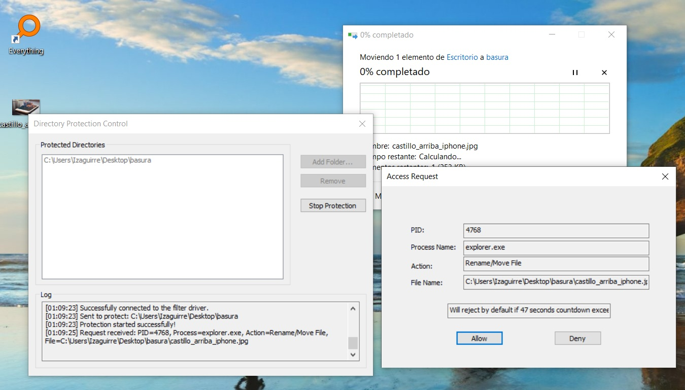

# Windows Directory Protection MiniFilter

## 🛡️ Project Overview

The Windows Directory Protection MiniFilter is a security application for Windows that prevents unauthorized write access (creation, modification, deletion, and renaming) to user-specified folders. It operates by combining a **kernel-mode minifilter driver** to intercept file system I/O requests and a **user-mode application** to manage protected paths and prompt the user for real-time access control decisions.

---

## 💡 Technical Principles and Flow

The system is fundamentally divided into two parts: the kernel-mode driver (`DirProtectDrv.sys`) and the user-mode application (`DirProtectApp.exe`).

The **User-Mode Application** first establishes a connection with the driver via the Filter Manager's communication port (`FilterConnectCommunicationPort`). Upon activation ("Start Protection"), it sends the list of protected directory paths (converted from user-friendly DOS paths like `C:\Folder` to kernel-friendly NT paths like `\??\C:\Folder`) to the driver using `FilterSendMessage`. It then spins up a **Communication Thread (`CommunicationThreadProc`)** which continuously waits for access requests from the driver using the asynchronous call `FilterGetMessage` with an `OVERLAPPED` structure. When the driver intercepts a protected operation, the thread is signaled, a popup dialog (`AlertDlgProc`) is displayed to the user for a decision (Allow or Deny, with a 60s countdown, deny if exceeded), and the outcome is sent back to the driver using `FilterReplyMessage`.

The **Kernel-Mode Driver** registers various pre-operation callback routines (`NPPreCreate`, `NPPreWrite`, etc.) with the Filter Manager for write-related I/O requests (`IRP_MJ_CREATE`, `IRP_MJ_WRITE`, etc.). Before processing an I/O request, the driver first checks a **PID-based Intent Cache** to see if a recent decision (within 2 seconds, `PID_CACHE_TIMEOUT_SECONDS=2`) has already been made for the requesting process ID (PID). This is critical for preventing an overwhelming number of popups for multi-step file operations (like saving a file) and avoiding deadlocks. If no cached decision is found, the driver checks if the target path is under a protected directory. If so, and if no other prompt is currently active (`global.is_user_prompt_active`), it collects the PID, process name, and file path, wraps them into a `MINI_REQUEST` structure, inserts it into a queue (`global.head_minirequest`), sets the `global.is_user_prompt_active` flag, and **pends** the I/O operation using `FLT_PREOP_PENDING`. A dedicated **Worker Thread (`ThreadProc`)** in the driver monitors this request queue, retrieves the request data, and uses `FltSendMessage` to forward the access details to the waiting user-mode application thread. Once the user replies via `FilterReplyMessage`, the worker thread processes the reply, updates the **Intent Cache** with the decision for the requesting PID, and finally calls `FltCompletePendedPreOperation` to either allow the operation (`FLT_PREOP_SUCCESS_NO_CALLBACK`) or deny it (`STATUS_ACCESS_DENIED`, `FLT_PREOP_COMPLETE`). After completing the current request, the driver continues to check whether the request exists in the linked list. If no request is present, it waits for an event. This event is triggered when the precreate callback function inserts information into the linked list, and it is also triggered within the driver's Unload function. Upon deactivation("Stop Protection"), the `NPUnload` routine will be triggered. At this point, the driver removes protection, deletes information from the directory global list, and completes requests already saved in the request global list (denying access to that request).

---

## 🛠️ Usage

### Prerequisites
* Windows operating system (Requires appropriate driver signing and kernel-mode debugging setup for development/testing).
* Visual Studio with Windows SDK and WDK (Driver Development Kit).

### Instructions
1.  **Build the Project:** Compile both the Minifilter Driver (`DirProtectDrv.sys`) and the User-Mode Application (`DirProtectApp.exe`). Don't forget to sign your driver, and enable `/testsigning` and `/nointegritychecks` in your BCD if you signed it with a self-sign certificate.
2.  **Load the Driver:** First, install the driver INF (`DirProtectDrv.inf`); then, run `sc start DirProtect` or `fltmc start DirProtect` to load the driver.
3.  **Run the Application:** Execute `DirProtectApp.exe`.
4.  **Add Directories:** Click "**Add Folder...**" and select the directories you wish to protect.
5.  **Start Protection:** Click "**Start Protection**".
6.  **Real-time Alert:** Any attempt by an unauthorized process to perform a write operation (create, delete, rename, modify) within the protected directory will trigger an "**Access Request**" popup.
7.  **Decision:** Click "**Allow**" or "**Deny**". The action will be enforced, and the decision will be temporarily cached for that process.
8.  **Exit**: Click "**Stop Protection**", then run `sc stop DirProtect` or `fltmc unload DirProtect` to unload the driver after use. If you want to thoroughly uninstall the driver, just run `sc delete DirProtect`.

---

## ⚠️ Known Issues and Limitations

* **Single Active Prompt:** The driver enforces a strict single-request policy (`global.is_user_prompt_active`). If a new protected I/O request arrives while the previous one is still waiting for a user decision, the new request is immediately **denied** (`STATUS_ACCESS_DENIED`) to prevent resource exhaustion and potential deadlocks.
* **Time-Limited Decision Cache:** The PID-based decision cache only lasts for **2 seconds**. This is an intentional design choice to handle burst I/O requests (like copy/save operations) as a single user action while still requiring an explicit decision for separate, subsequent actions.
* **Path Conversion:** Relies on `QueryDosDeviceW` for DOS path to NT path conversion, which is standard but must be handled correctly for multi-volume/network path scenarios (though the current implementation focuses on local drives).
* **Privilege Escalation:** The minifilter driver runs in kernel mode and can be a single point of failure. It must be handled with care and is not intended for production without thorough security auditing and robust error handling.
* Other possible issues that I haven't found. YOU TELL ME!

---

## 📜 License

This project is provided as-is, mainly for educational purposes regarding Windows minifilter driver development and inter-process communication between kernel and user mode.

**License:** [MIT](LICENSE).

---

## 📸 Screenshots

